# Amazon EC2 Quickstart

EC2 is a way of having an easily-customizable server of your own that isn't your laptop. Practically [every site ever](https://www.quora.com/What-are-the-largest-consumer-sites-that-run-on-EC2) uses EC2 these days as their servers (we can't all [be Google](http://news.sky.com/story/999358/inside-google-pictures-of-data-centres-released)).

This starts off as a quickstart, but then get a little more involved when we got into IPython Notebook territory. Make sure to check the very last step no matter *what*, though.

## 1. Visit [http://aws.amazon.com](http://aws.amazon.com) to sign in

## 2. Select EC2 from the list of services

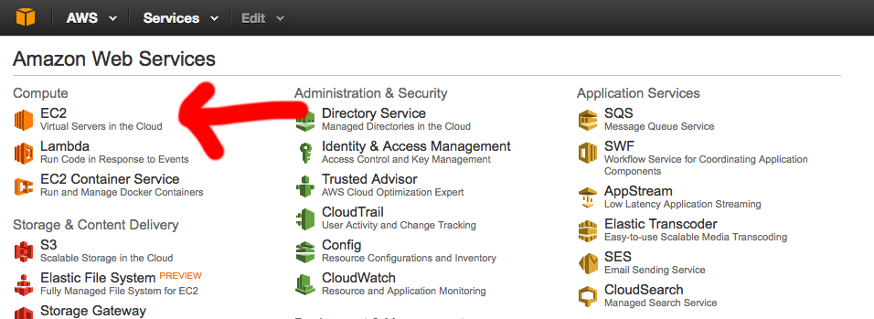

## 3. Click 'Launch Instance'

An "instance" is a fancy way of saying "a server" which is a fancy way of saying "a computer that connects to the Internet."

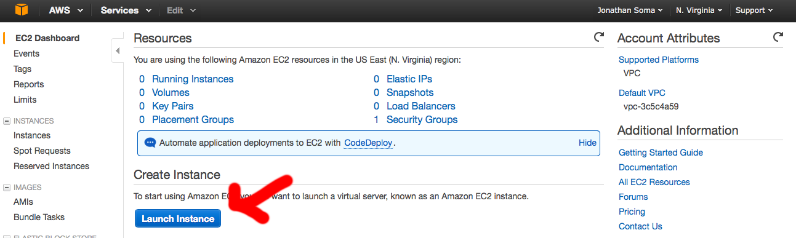

## 4. Select an AMI

An AMI is more or less your basic operating system.

Instead of picking between Windows and OS X, though, you get to pick a flavor of Linux! I'd recommend using Ubuntu Server, since it's probably going to be the most google-able if you have any problems. The Amazon Linux AMI is my second choice, since a lot of AWS folks use it.

Other AMIs are floating around out there with pre-installed software on them, kind of like how Anaconda came with a lot of pre-installed software, but you can usually start from scratch without too much work.

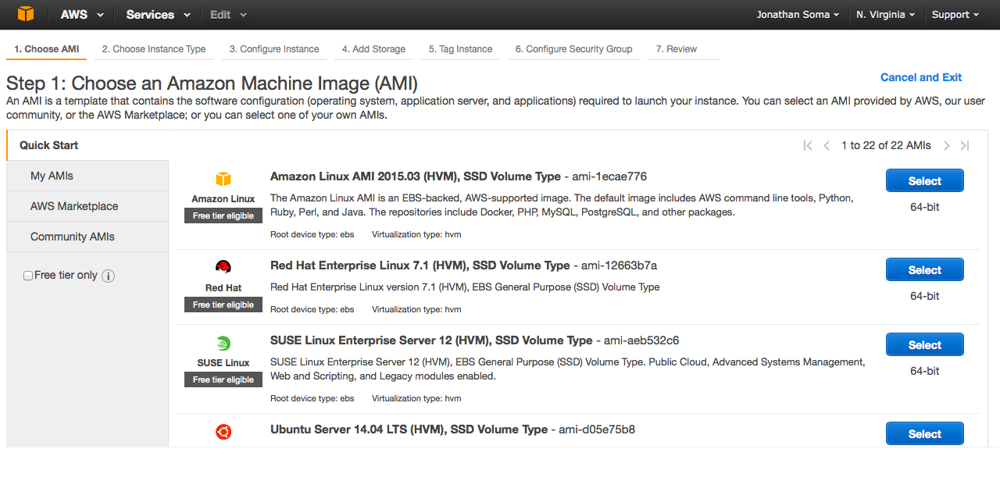

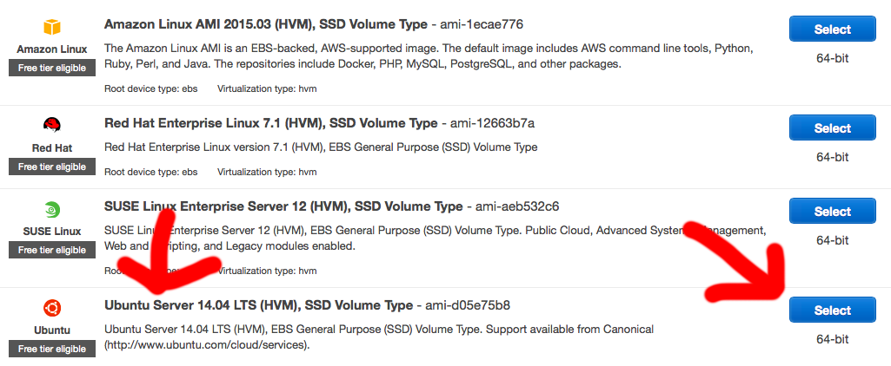

## 5. Select your instance type

How powerful do you want your machine to be? Does it need a lot of RAM, or a strong CPU, or fancy video cards?

In this case the important thing is that it's **free**, so we're going to pick `t2.micro`. It only has 1GB of RAM, though, so if you're really crunching numbers you might end up upgrading.

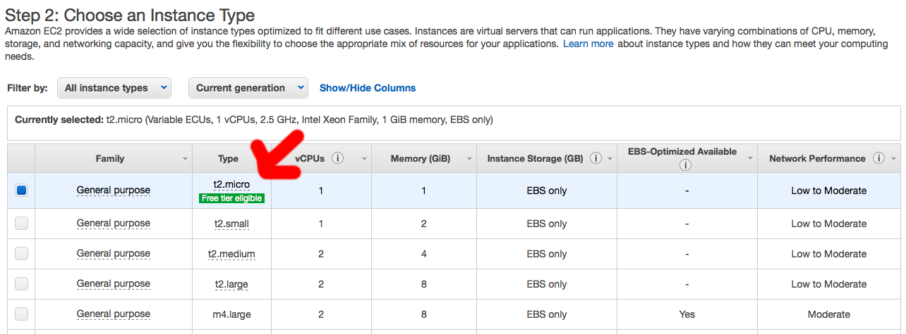

## 5. LAUNCH!

While there are other options available, they aren't really important to us right now. If you get into EC2, though, just give them a quick Google! Time to LAUNCH!

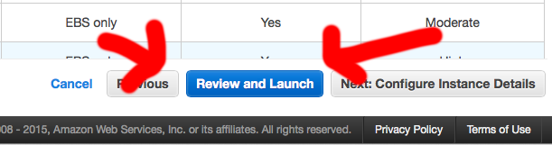

## 6. Ignore the security group warning

Oh wait, you don't get to launch just yet.

I hope you aren't too excited, because Amazon immediately starts to yell at you about how dumb you are. What a goof, we left it open to the entire world!

Honestly, it doesn't matter. It's just saying "anyone on the internet can *try* to access your machine," but with the security settings Amazon uses by default they're going to have a heck of a time breaking in. *Every* server connected to the internet is accessible from any IP address, so it's no big deal.

If you're interested, though, there's plenty of tweaking that can be done with security groups.

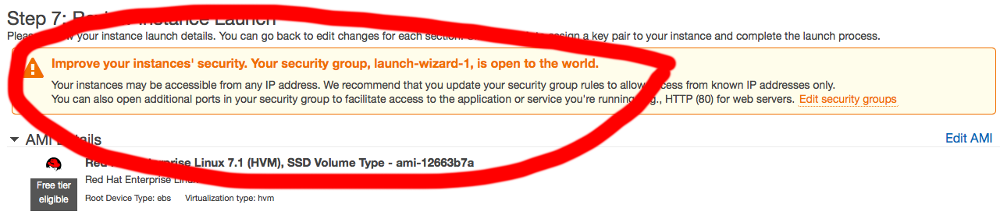

## 7. LAUNCH! (again)

Click it!

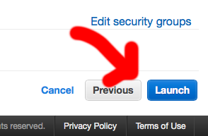

## 8. LOL J/K no launching, it's time for security keys

A key pair is how you prove you're allowed to connect to your server - it keeps one file, you keep one file, and they're matched when you try to connect.

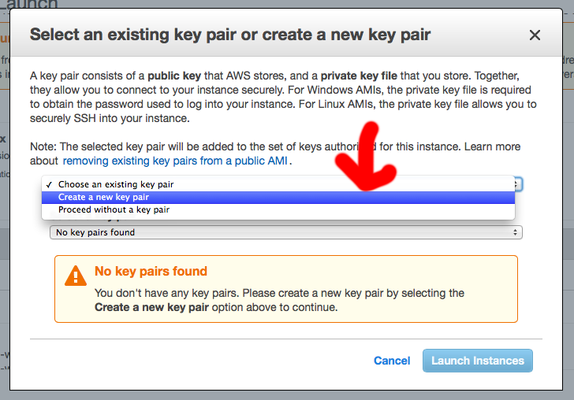

You don't have any key pairs yet, so generate a new one called `lede` and save the file they generate for you.

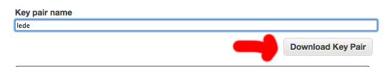

It'll download a file called  (most likely) `lede.pem.txt` that looks like a bunch of garbage. In reality, it's a reaaaally big prime number. **NEVER PUT THIS ON GITHUB EVER EVER EVER EVER EVER.**

***EVER.***

## 9. Actually launch for real this time

Finally, it launches!

## 10. Billing alerts (optional)

We'll skip this during class, but in case you accidentally spun up a huge powerful server and forget to turn it off, billing alerts are great ways to not end up with a $400 bill at the end of the month.

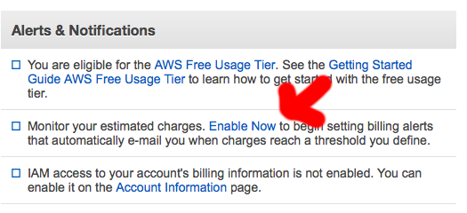

## 11. Connecting to your server

You connect to your server using [SSH](https://en.wikipedia.org/wiki/Secure_Shell), a way to connect to another computer using the command line. It's useful and badass and a great thing to know, even though it's more or less just wandering around another computer in terminal.

First thing you'll want to do is move your `lede.pem.txt` file to somewhere safe. Maybe your `lede` folder? Just make sure you **never ever put it into `git`**.

Then you'll need to get your server's IP address. When you click "View this instance" or launch your EC2 management console, you'll be able to select your server. The **Public IP** is what you're looking for.

Open up Terminal and make your way to the directory that has `lede.pem.txt` in and execute the following command:

	ssh -i lede.pem.txt ubuntu@YOUR_IP_ADDRESS

You'll probably get an error message, even once you say "Yes, continue!" It's because the private key (`ledepem.txt`) is viewable by other people who use our computer, so we need to change it's security settings

	chmod 600 lede.pem.txt

You can learn more about `chmod` [on Wikipedia](https://en.wikipedia.org/wiki/Chmod) or [computerhope.com](http://www.computerhope.com/unix/uchmod.htm).

Then try your `ssh` command again, and voila! ...it looks like not much happened, you're still on the command line. Give it a `pwd`, though, and you'll see you aren't on your own computer any more.

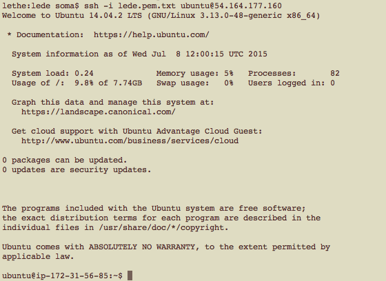

## 12. Navigating your server

All of the normal commands work, `cd` and `pwd` and `python`.

## 13. Installing Anaconda

Not `ipython notebook`, though, you'll need to [install Anaconda on your server](http://docs.continuum.io/anaconda/install.html#linux-install) for that to work.

As of this instant, it takes two steps - downloading the install file using `curl` and running it using `bash`

	curl -O https://3230d63b5fc54e62148e-c95ac804525aac4b6dba79b00b39d1d3.ssl.cf1.rackcdn.com/Anaconda-2.3.0-Linux-x86_64.sh
	bash Anaconda-2.3.0-Linux-x86_64.sh

Say **yes** to everything Anaconda asks you, **SOMETIMES IT DEFAULTS TO NO SO MAKE SURE YOU TYPE YES INSTEAD!!!**

If you type `which python` you'll see that it's still using `/usr/bin/python` instead of your brand new Python. Why's that? Well, it says explicitly: "For this change to become active, you have to open a new terminal."

Type `exit` to disconnect from your server, reconnect using `ssh`, and then if you run `which python` again you'll see it's now `/home/ubuntu/anaconda/bin/python`. Whew.

## 14. Enabling IPython Notebooks

We'll need to password-protect our notebooks since this will live on the Internet! First we need a password. Run `ipython` to open up an interactive Python shell, then run the following

	from IPython.lib import passwd
	passwd() 
	exit

You'll get some output that looks like `sha1:96fa88f505da:cf06ee9cb186b91a91f446b9e7ce5abf3498215f` - save it! It's the **hashed** version of your password.

Then we'll create an ipython profile for the server and put our password in it.

	ipython profile create nbserver
	nano /home/ubuntu/.ipython/profile_nbserver/ipython_notebook_config.py

`nano` is a text editor! It's kind of confusing, but muddle around until you've uncommented/edited the following lines. You can use `ctrl+w` to search.

	 c.NotebookApp.open_browser = False
	 c.NotebookApp.password = u'sha1:96fa88f505da:cf06ee9cb186b91a91f446b9e7ce5abf3498215f'
	c.NotebookApp.ip = '*'

To save and exit you'll want to `ctrl+x`, `yes`, and `Enter`.

Now you can run your notebook server with

	ipython notebook --profile=nbserver

So how do you visit it? Well, we're still missing *one thing*, and that's security settings.

## 15. Changing security settings

Right now we can't access port 8888 on the server, it's too locked down! You'll need to hop back to [the EC2 console](https://console.aws.amazon.com/ec2/v2/home) to change your security settings.

Click your instance and then click Whatever is under `Security groups`.

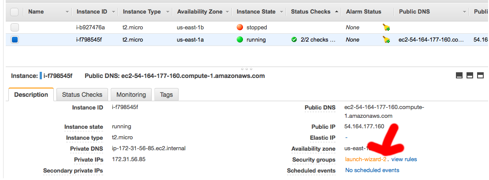

We want people to be able to **connect with a web browser on port 8888**, so first we select **Inbound** and then click **Edit**.

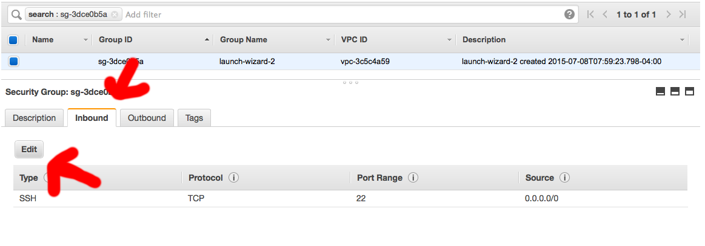

Add a new `TCP` rule, allowing traffic to port `8888` from `Anywhere`. Click **Save**.

## 16. Opening your IPython Notebook

First, connect to your server (see 13 above) and run

	ipython notebook --profile=nbserver

Then take the IP address of your server and plug it into your browser along with `:8888`

Enter the password you typed in before, and **THERE YOU GO!**

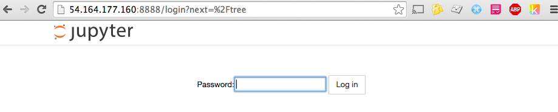

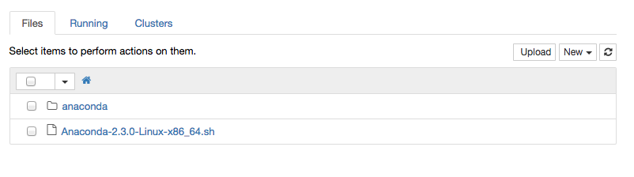

## 17. Disconnecting from your server

That's easy: `exit`. You'll also need `ctrl+c` if you have IPython Notebook running.

## 18. Turning off your server

Even though we can run this for an entire year for free, let's give it a pause when we're done using it. Head back to your [EC2 management console](https://console.aws.amazon.com/ec2/v2/home), click "Running Instances" or "Instances" on the sidebar. Select your instance and then select `Actions > Instance State > Stop`

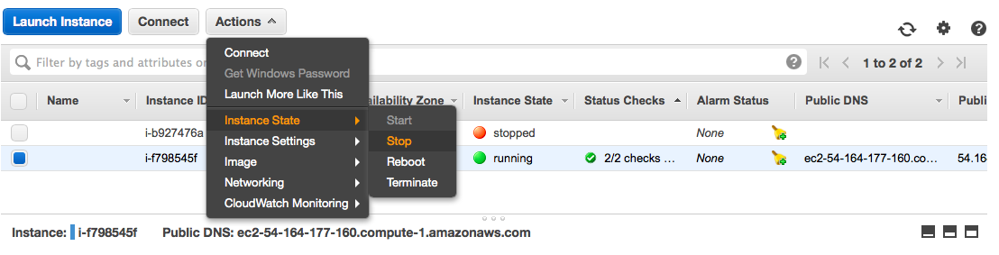
