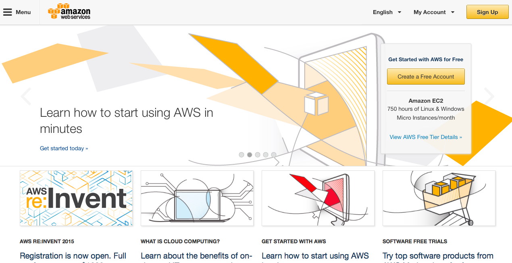
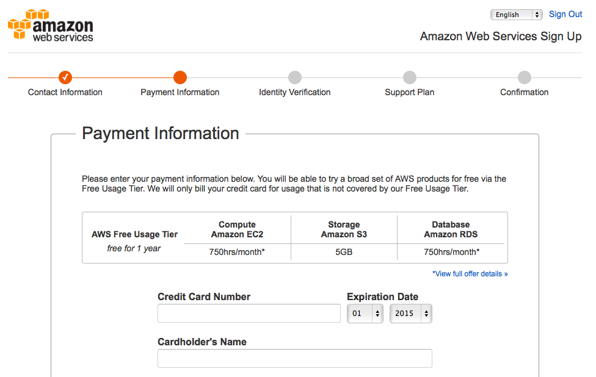
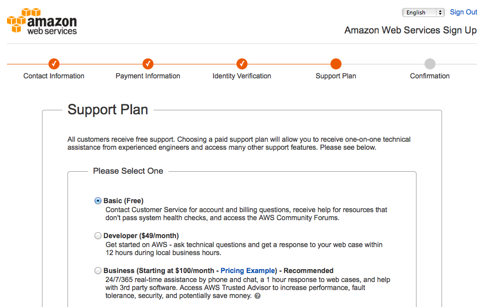
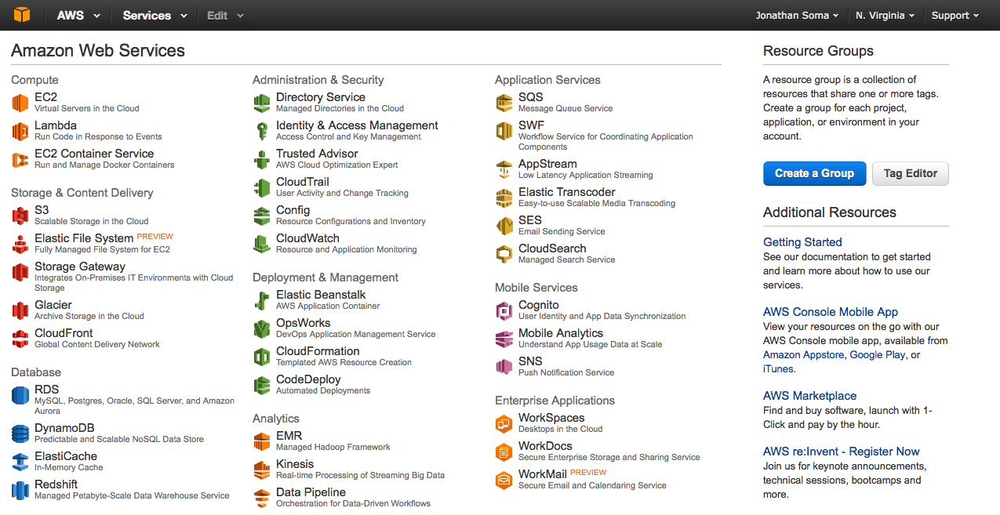

# Amazon Web Services Signup

## 1. Visit [http://aws.amazon.com](http://aws.amazon.com). 

You'll need to sign in with your Amazon.com account or create a new account. I'm not sure if this works with international Amazon accounts!

## 2. Insert some payment information

Don't worry, they won't bill you. We'll only be using the AWS Free Usage Tier - it's more than enough for what we need to take care of.

## 3. Phone Confirmation

Give them your phone number and you'll get a call to confirm that you're a real live person with a phone number. You'll need to enter a code to continue.

## 4. Support Plan

Pick the free one, of course.

## 5. Click "Launch Management Console"

Now we're talking! Web services galore.

