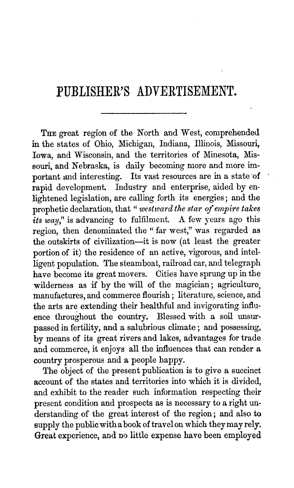
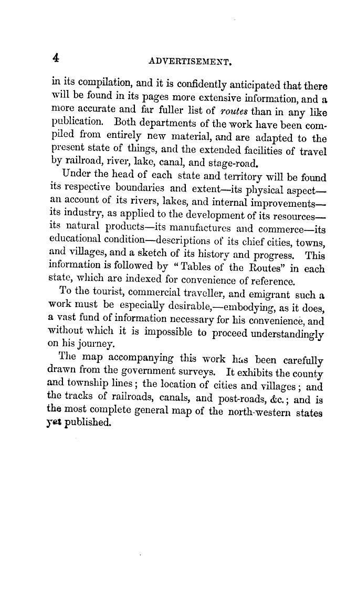
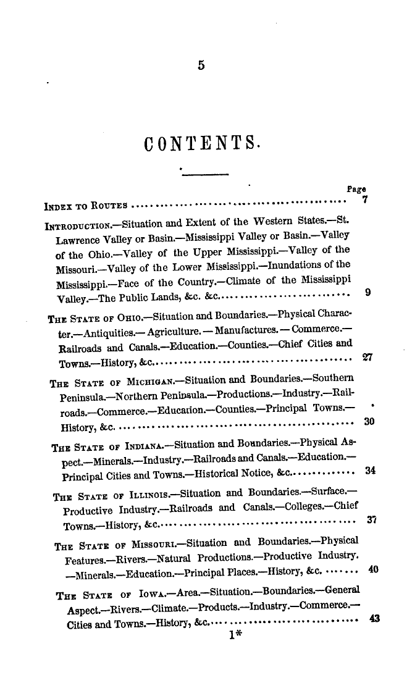
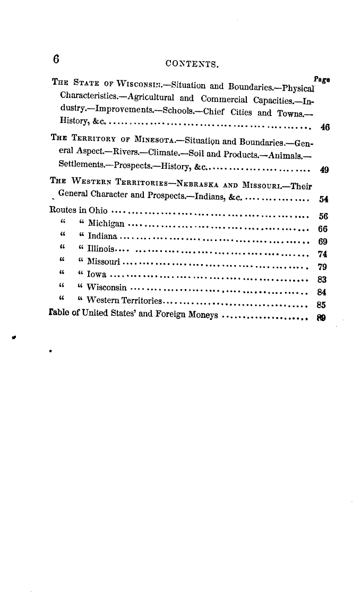
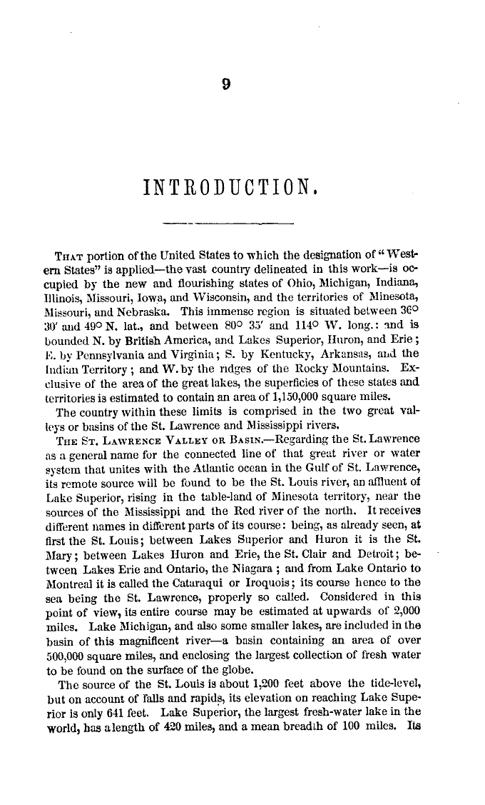
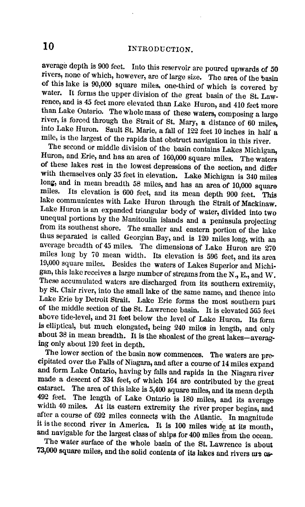
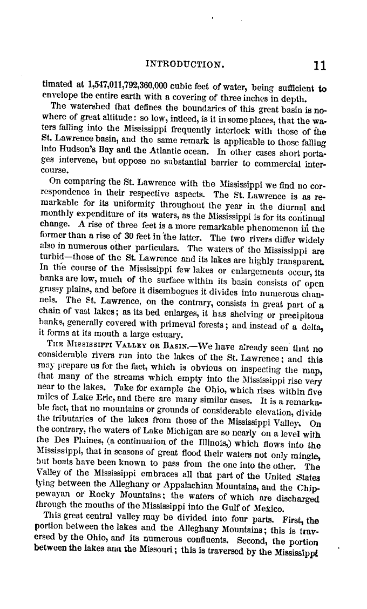
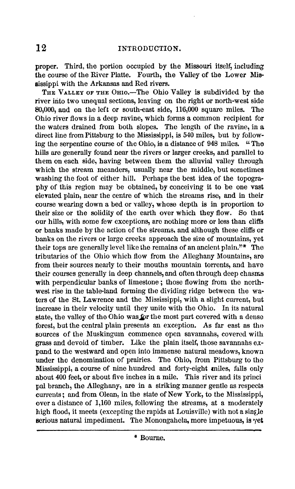

# Amazon Mechanical Turk

[Mechanical Turk](https://www.mturk.com/mturk/welcome) is a way of getting simple tasks completed by real people, things like categorizing objects or copying text from images or all sorts of other stuff.

For example, let's say I have some images from [this book](http://quod.lib.umich.edu/m/moa/aja3435.0001.001?view=toc) and need to get the text off of them. Mechanical Turk to the rescue!

